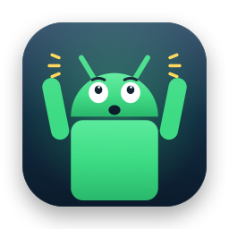
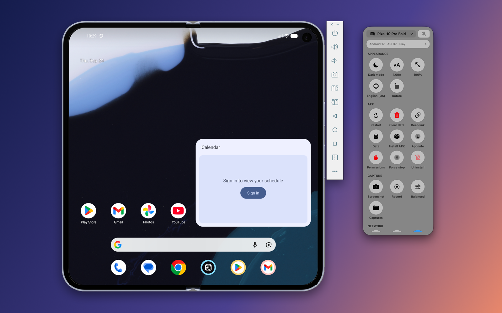

<p align="center">
  
</p>

<h1 align="center">Oh My Android</h1>

<p align="center">
  <b>The control panel Google's Android emulator is missing.</b><br>
  A floating Liquid Glass panel for macOS that turns daily Android test chores into one click.
</p>

<p align="center">
  <a href="https://github.com/ateymoori/oh-my-android/actions/workflows/build.yml"></a>
  
  
  <a href="LICENSE"></a>
</p>

<p align="center">
  
</p>

Oh My Android docks beside the emulator window and gives you dark mode, font and display scale, language,
TalkBack, layout bounds, network conditions, GPS, battery, screenshots, screen recording, deep links
and actions on the foreground app as icons. It works on emulators and on real devices (USB or Wi‑Fi adb).

It is a wrapper, not an emulator. It drives the Android SDK already on your Mac. Nothing is bundled.

## Install

```sh
brew install --cask ateymoori/tap/oh-my-android
```

Or download the notarized zip from [Releases](https://github.com/ateymoori/oh-my-android/releases), unzip, and
move `Oh My Android.app` to Applications.

Requirements: macOS 26 or later and an Android SDK: [Android Studio](https://developer.android.com/studio),
or `brew install --cask android-commandlinetools`. Oh My Android finds the SDK in `~/Library/Android/sdk`,
`ANDROID_HOME`, `ANDROID_SDK_ROOT` and the Homebrew folders. Apps opened from Finder do not see shell
variables, so if the SDK is somewhere else, pick it in **Settings → Android SDK → Choose…**.

## What it does

| Block | Icons |
|---|---|
| Appearance | Dark mode · Font size · Display size · Language (incl. RTL and pseudo-locales) · Rotate |
| App (foreground app) | Restart · Clear data · Deep link · Data Inspector · Install APK (or drop it on the panel) · App info · Reset permissions · Force stop · Uninstall |
| Capture | Screenshot (saved and copied) · Screen recording with audio · Quality · Captures folder |
| Network | Speed and latency profiles (LTE → GSM) · Airplane mode · Wi‑Fi · Mobile data |
| Layout & performance | Layout Inspector · Layout bounds · Overdraw · GPU bars · Show taps · Pointer location · Animations off · Developer options |
| Accessibility | TalkBack · Bold text · Invert colors |
| Navigation & input | Back · Home · Recents · Type text · Hide keyboard · Soft keyboard |
| Simulate (emulator) | City or custom GPS · Battery level · Charging · Fingerprint · Incoming call · SMS |
| Snapshots (emulator) | Save state · Restore |

Every icon shows the device's current state, read back from the device. Destructive actions ask first.

### Layout Inspector

Freezes the screen: screenshot plus the view / Compose semantics tree from `uiautomator dump`.
Hover shows an element and its size in dp. Click one, hover another, and you get Figma-style distance
lines (gaps between siblings, paddings inside a parent). Also: an 8 dp grid, a color picker, ≈ sp text
size, and a **design overlay**: drop a Figma PNG export, choose 1×/2×/3× or Fit width, set opacity or
Difference blend, and nudge it with the arrow keys.

**Accessibility mode** (⇧⌘A) numbers every stop in approximate TalkBack order and flags unlabeled
controls, images without descriptions and touch targets under 48 × 48 dp.

### Data Inspector

Read-only browser for the SharedPreferences and SQLite databases of **debuggable** apps, through
`adb shell run-as`: the same access Android Studio uses. Release builds stay closed, by design.
Nothing on the device is written.

## Privacy and safety

- No network access of its own. No analytics, no telemetry, no accounts.
- Only talks to your local `adb`. Text you type is shell-quoted before it reaches the device.
- Database copies from the Data Inspector are deleted on reload and when Oh My Android quits.
- Signed with a Developer ID, hardened runtime, notarized by Apple. Not sandboxed, because the
  App Sandbox cannot start `adb`. That is also why Oh My Android is not in the Mac App Store.

See [SECURITY.md](SECURITY.md) to report a vulnerability.

## Build from source

```sh
brew install xcodegen
git clone https://github.com/ateymoori/oh-my-android.git && cd oh-my-android
xcodegen generate
open OhMyAndroid.xcodeproj
```

Needs Xcode 26. Local builds are ad-hoc signed; no Apple Developer account needed.
The app icon is drawn in code: `Scripts/make-icon.swift`.

## Architecture

```
Sources/
  App/        entry point, AppDelegate (host actions), Settings, assets
  Core/       no UI, no feature knowledge
    Shell/    ShellRunning: non-blocking Process runner with a watchdog timeout
    Android/  AndroidSDK, ADBClient, DeviceTracker (adb track-devices), UI hierarchy, app data
    SQLite/, Imaging/
  Features/   one small type per capability, registered in FeatureCatalog (Foundation only)
  State/      AppModel (composition root), DeviceStore, FeatureStore, inspector stores
  Windows/    FloatingPanel, emulator window docking, tool windows
  UI/         SwiftUI; FeatureCell renders any feature from its protocol
```

Dependencies point one way: `UI → State → Features → Core`. Features talk to the device through the
`ADBClient` protocol and to the Mac through `HostActions` (file picker, clipboard, Finder), so each one
is a small, testable value type. Swift 6 language mode, strict concurrency, zero warnings.

| Protocol | Control | Example |
|---|---|---|
| `ToggleFeature` | on/off icon | Dark mode, TalkBack, Wi‑Fi |
| `BatchReadable` (add-on) | state read in one shared `adb shell` round-trip | every `settings` / `getprop` feature |
| `StepperFeature` | popover with −/+ | Font size, Display size |
| `ChoiceFeature` | menu | Language, Network speed, Battery |
| `ActionFeature` | one tap | Screenshot, Rotate, Force stop |
| `TextActionFeature` | popover with a text field | Deep link, Type text, SMS |

Adding a feature is one struct and one line in `FeatureCatalog`. See [CONTRIBUTING.md](CONTRIBUTING.md).

### Energy

Nothing polls adb. Device changes arrive from adb's own `track-devices` stream. Feature values are read
once per device selection, after each action (that feature only), and when the pointer re-enters the
panel after 5 s, as **one batched `adb shell` call** plus a few console reads for emulator-only
features. While no device is ready, Oh My Android re-checks every 4 s until one is, then stops. Docking uses a
1 Hz timer only while a `qemu-system` process exists and the panel is visible.

## Roadmap

- Compare mode: two devices, mirrored input, pixel diff.
- Embedded screen through the emulator's gRPC `streamScreenshot`.
- Decode DataStore `.preferences_pb` in the Data Inspector.

## License

[MIT](LICENSE) © 2026 Royan AB. Android is a trademark of Google LLC. Oh My Android is not affiliated with Google.
